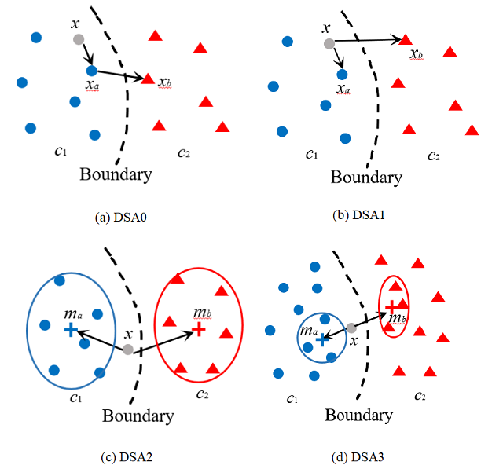
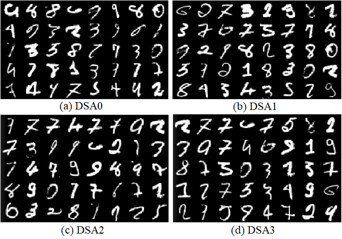

# Corner Case Description and Detection 

If you find this code helpful, please consider to cite our paper "Corner case description and detection" ["paper"](https://arxiv.org)

```
{
	Author = {Tinghui Ouyang}
        Affiliation={Arificial Intelligent Research Center, AIST}
}  
```

## Introduction

In reference [[Ref]](https://arxiv.org/abs/1808.08444), an idea of using surprise adequacy to describe data's behaviors was proposed. The surprise adequacy is based on the activation trace of a specific hidden layer in DNN models, 
and able to capture data's distribution characteristics. Based on this idea, we modify definition of the proposed distance-based surprise adequacy (DSA) with respect to corner cases in AI quality assurance.
And utilize these modified DSAs in description and detection of corner case data. This archive includes code for computing DSA values and evaluating performance on using dsa for corner case data detection, 
which are basic components of the main experiments in the paper. Currently, the "run.py" script can realize corner case detection with four DSAs on the MNIST dataset, only considering the last hidden layer (activation_3). Layer selection can be easily changed by modifying `layer_names` in run.py.

Diagrams of four different DSA definitions are presented below




## corner cases by different dsa definitions
Results of corner case data detection based on those four DSA definitions above are drawn as below
 



### Files and Directories

- `run.py` - Script processing corner case detection with different dsa definitions .
- `dif_dsa.py` - Tools that calculates activation traces, compute different DSA, and plot results.
- `train_model.py` - Model training script for MNIST. It keeps the trained models in the "model" directory 
- `model` directory - Used for saving models.
- `tmp` directory - Used for saving corner case images.

### Command-line Options of run.py

- `-d` - The subject dataset. Default is mnist.
- `-dsa` - If set, select different DSA definition. Default is dsa0
- `-save_path` - The temporal save path of corner case images. Default is tmp directory.
- `-batch_size` - Batch size. Default is 128.
- `-var_threshold` - Variance threshold. Default is 1e-5.
- `-num_classes` - The number of classes in dataset. Default is 10.
- `-is_classification` - Set if task is classification problem. Default is True.


## How to Use

Our implementation is based on Python 3.5.2, Tensorflow 1.9.0, Keras 2.2, Numpy 1.14.5. Details are listed in `requirements.txt`.

This is a simple example of using modified DSA for corner case detection on MNIST dataset.

```bash
# install Python dependencies
pip install -r requirements.txt

# train a model
python train_model.py -d mnist

# corner case detection based on DSA, e.g. dsa0, dsa1, dsa2, dsa3
python run.py -dsa dsa0
```

## Notes

- If you encounter `ValueError: Input contains NaN, infinity or a value too large for dtype ('float64').` error, you need to increase the variance threshold.
- Images were processed by clipping its pixels in between -0.5 and 0.5.
- If you want to select specific layers, you can modify the layers array in `run.py`.
- For speed-up, use GPU-based tensorflow.
  
## References

["The original definition of distance-based surprise adequacy "](https://arxiv.org/abs/1808.08444)
